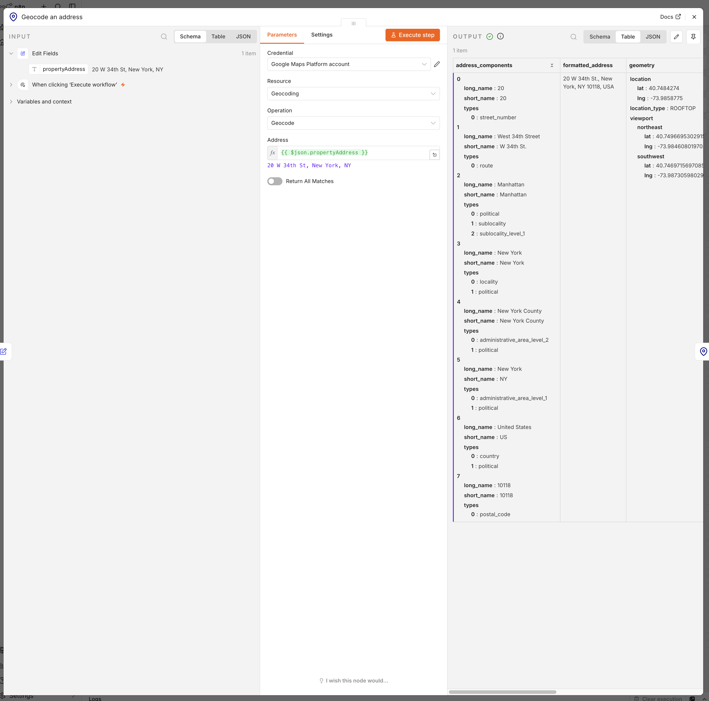
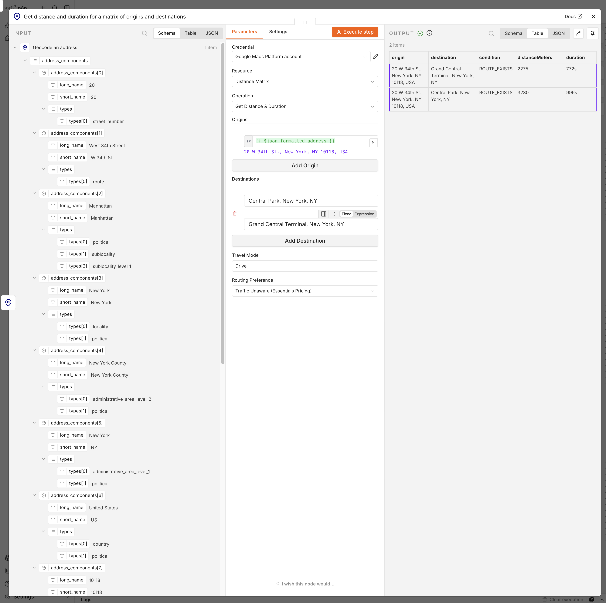

# n8n-nodes-google-maps-platform

An n8n community node for the official Google Maps Platform APIs — Geocoding, Directions, Distance Matrix, and Timezone — with proper credential handling and error messages instead of raw HTTP Request nodes.

Directions and Distance Matrix are built on Google's current **Routes API**, not the legacy Directions/Distance Matrix APIs (those are feature-frozen and unavailable to new Google Cloud projects).

## What's included

| Resource | Operation | What it does |
|---|---|---|
| Geocoding | Geocode | Address → coordinates, formatted address, place components |
| Geocoding | Reverse Geocode | Coordinates → human-readable address |
| Route | Get Route | Origin + destination (as address, coordinates, or Place ID) (+ optional departure/arrival time and waypoints) → distance, duration, turn-by-turn steps, polyline |
| Distance Matrix | Get Distance & Duration | Batch of origins × destinations → distance/duration for every pair |
| Timezone | Get Timezone | Coordinates + point in time → IANA timezone ID and UTC offset |

The node is also available to n8n's **AI Agent** nodes as a tool (`usableAsTool: true`) — an agent can resolve an address or compute an ETA mid-conversation without a separate HTTP Request tool definition.

## Installation

In n8n: **Settings → Community Nodes → Install**, then enter `n8n-nodes-google-maps-platform`.

For a self-hosted/npm-based install:

```bash
npm install n8n-nodes-google-maps-platform
```

## Credential setup

1. In [Google Cloud Console](https://console.cloud.google.com/), create or select a project, and **link a billing account** — Google requires this even to use the free tier.
2. Enable the three APIs this node needs (they're billed and enabled independently of each other):
   - [Geocoding API](https://console.cloud.google.com/apis/library/geocoding-backend.googleapis.com)
   - [Routes API](https://console.cloud.google.com/apis/library/routes.googleapis.com) (covers both Directions and Distance Matrix)
   - [Time Zone API](https://console.cloud.google.com/apis/library/timezone-backend.googleapis.com)
3. Create an API key under **APIs & Services → Credentials**.
4. **Restrict the key by API**, selecting the three APIs above — do **not** use website/referrer or IP restrictions. n8n calls Google server-to-server, so there's no browser referrer to check, and IP restrictions break the moment your n8n instance's outbound IP changes (common on n8n Cloud or any dynamic-IP host).
5. In n8n, create a **Google Maps Platform API** credential and paste in the key.

The credential's built-in test only calls the Geocoding API — a green check confirms the key and Geocoding are working, but **does not** confirm Routes or Timezone are enabled on the same project. If Route/Distance Matrix/Timezone operations fail with an auth-looking error after the credential test passes, double check those two APIs are actually enabled in step 2.

## Example use case

Standardize and geocode property addresses, then compute distance to key amenities:

1. **Geocoding → Geocode** each address in your list to get clean, standardized coordinates and a formatted address.
2. **Distance Matrix → Get Distance & Duration** with those coordinates as origins and your amenities (transit, schools, grocery stores) as destinations, to get travel distance/time to each.
3. Feed the result into whatever scores or filters listings by proximity.

Geocoding `20 W 34th St, New York, NY` returns a standardized, ROOFTOP-precision address and coordinates:



That result feeds directly into Distance Matrix as the origin, computing real distance and duration to two destinations in one call — note the output is labeled by address, not by the raw index Google's API actually returns:



## Billing — read this before running large batches

- The March 2025 pricing restructure replaced Google's flat monthly credit with **per-SKU free tiers**: 10,000 events/month for Essentials, 5,000 for Pro, 1,000 for Enterprise. Geocoding, Timezone, and basic Directions/Distance Matrix calls are Essentials.
- Setting **Routing Preference** to `TRAFFIC_AWARE` or `TRAFFIC_AWARE_OPTIMAL` on Get Route or Get Distance & Duration moves that request to the **Pro** tier and its lower 5,000/month cap. So does using more than 10 waypoints, or enabling **Optimize Waypoint Order** in Additional Fields, on Get Route.
- Setting **Travel Mode** to `Two Wheeler` on Get Route or Get Distance & Duration moves that request to the **Enterprise** tier — the smallest free tier of the three, at 1,000 events/month.
- **Get Distance & Duration bills per element**, not per request: `origins × destinations`. A 25×25 request is 625 billable elements — about 16 such calls exhausts the entire monthly Essentials free tier. This is invisible from the n8n canvas, where it looks like one node execution.

## Security notes

- The API key is visible in plaintext in n8n's execution logs and the "show request" debug panel. This is inherent to how Google's APIs authenticate (query param or header, not a signed token) and isn't something this node can hide.
- Restrict the key by API, not by referrer/IP (see credential setup above).

## Development

See [CLAUDE.md](CLAUDE.md) and [AGENTS.md](AGENTS.md) for the project's architecture notes and n8n node-building conventions, and [docs/google-maps-node-plan.md](docs/google-maps-node-plan.md) / [docs/google-maps-node-implementation.md](docs/google-maps-node-implementation.md) for the full build history and every gotcha hit along the way.

```bash
npm install       # install dependencies
npm run dev       # boots a local n8n at localhost:5679 with this node loaded
npm run build     # compile TypeScript
npm run lint      # eslint-plugin-n8n-nodes-base rules
npm test          # vitest unit tests for the response-shaping logic
```

## License

MIT — see [LICENSE](LICENSE).
